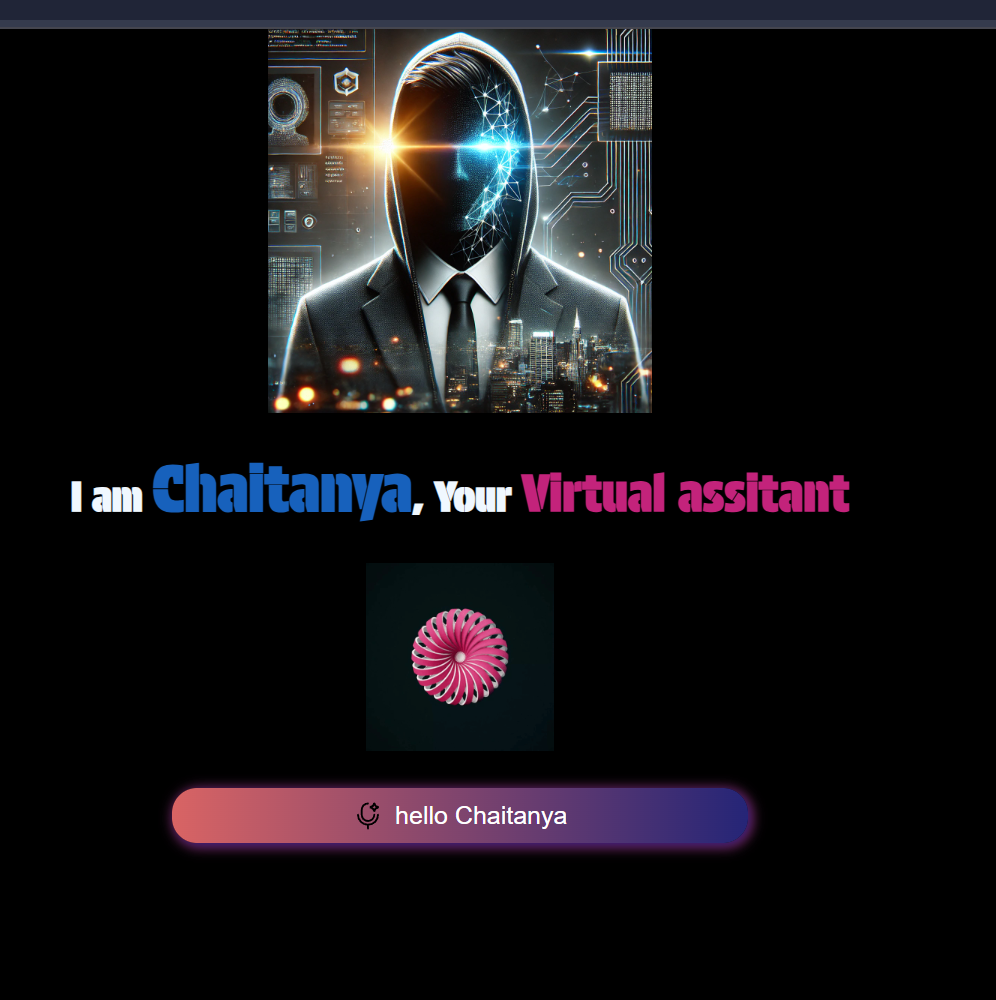

### **Chaitanya - Your AI Virtual Assistant**  
A **voice-controlled AI virtual assistant** that listens, responds, and performs tasks like opening apps, fetching weather updates, telling jokes, and more. 🚀  




## **Features**  
✅ Voice Recognition & Text-to-Speech  
✅ Male Voice Selection (Hindi - IN)  
✅ Open Websites (YouTube, Google, LinkedIn, etc.)  
✅ Fetch Current Time & Date  
✅ Tell Jokes & Motivational Quotes  
✅ Weather Updates  
✅ AI Search Functionality  
✅ Smooth UI with Animated Effects  


## **Tech Stack**  
🔹 **HTML** - Structuring the assistant UI  
🔹 **CSS** - Styling with animations & gradients  
🔹 **JavaScript** - Core logic, Speech API, Event Handling  

## **Installation & Setup**  
1. Clone the repository:  
   ```sh
   git clone https://github.com/your-username/chaitanya-virtual-assistant.git
   ```
2. Navigate to the project folder:  
   ```sh
   cd chaitanya-virtual-assistant
   ```
3. Open `index.html` in your browser.  

## **Usage**  
1. Click the **Voice Button** 🎙️  
2. Speak commands like:  
   - "Open YouTube"  
   - "What’s the time?"  
   - "Tell me a joke"
   - "who are you?"
   - "tell me the Date/Time"
   - "open any Desktop apps"

3. Watch the AI assistant respond! 

## **Contributing**  
Feel free to submit **pull requests** or report **issues** to improve this assistant!  

## **Author**  
👨‍💻 Developed by **Supriya Mishra**  
📌 **GitHub**: [Supriya Mishra](https://github.com/supriya4748)  

---
